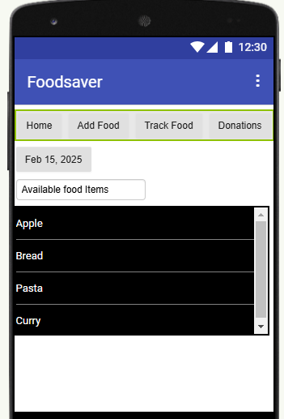
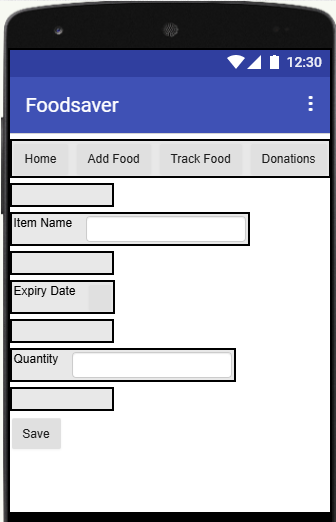
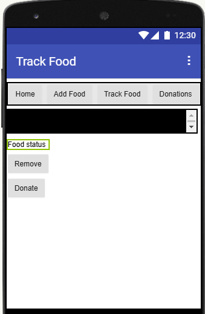
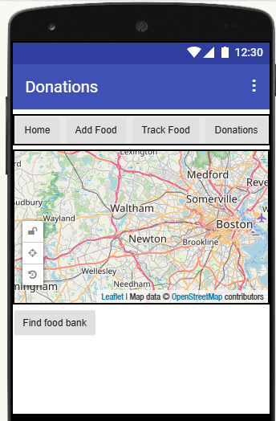
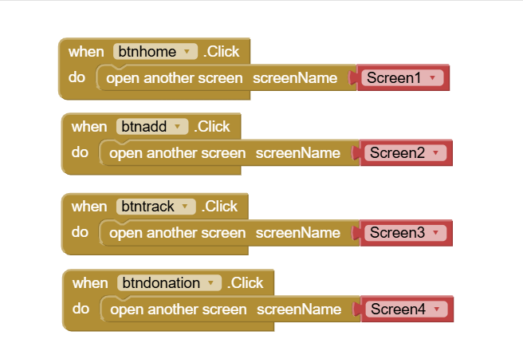
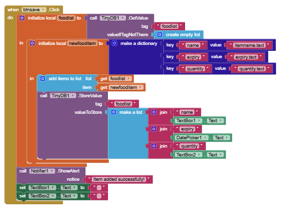
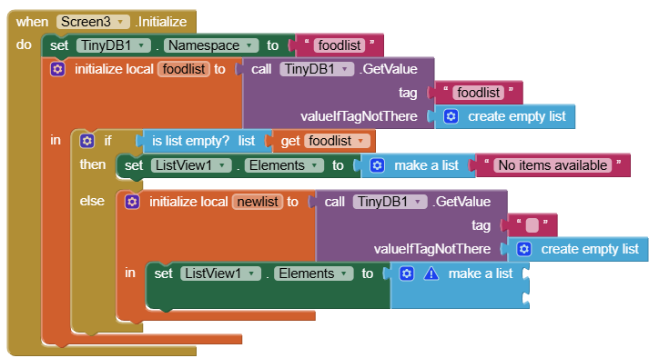

# MIT App Inventor Project
## Food Management App

### Overview of app
FoodSaver is a mobile app designed to help users track food expiration dates, reduce food waste, and donate extra food to local food banks. The app allows users to manage food items, check expiry date and find donation centers.

### App Screens

**Home Screen**
- **Buttons:** Add Food, View Food List, Find Donation Centers (These buttons are in every screen)

**Add Food Screen**
- **TextBox**: Food Name, Quantity
- **DatePicker**: Expiry Date
- **Button**: Save

### **Food List Screen**
- **ListView**: Displays stored food items
- **Buttons**: Dispose, Donate
- **label**: checks expiration date

### **Donation Map Screen**
- **Map Component**: Displays donation locations
- **Button**: find Donation center

---

### I am using TinyDB for Storing & Retrieving Food Items

## Conclusion
FoodSaver is an MIT App Inventor project that promotes food waste reduction by helping users track their food items, avoid food waste, and donate extra food. It provides a user-friendly interface and location-based donation services.

### Screenshots:

### Code Blocks:

## Note:
This app is not completed yet due to limited timeperiod. It could be better if I had enough time to implement all the features I had in my mind.

# ThankYou!!